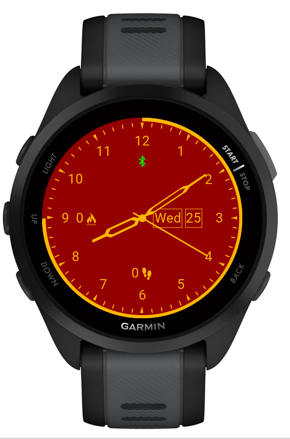
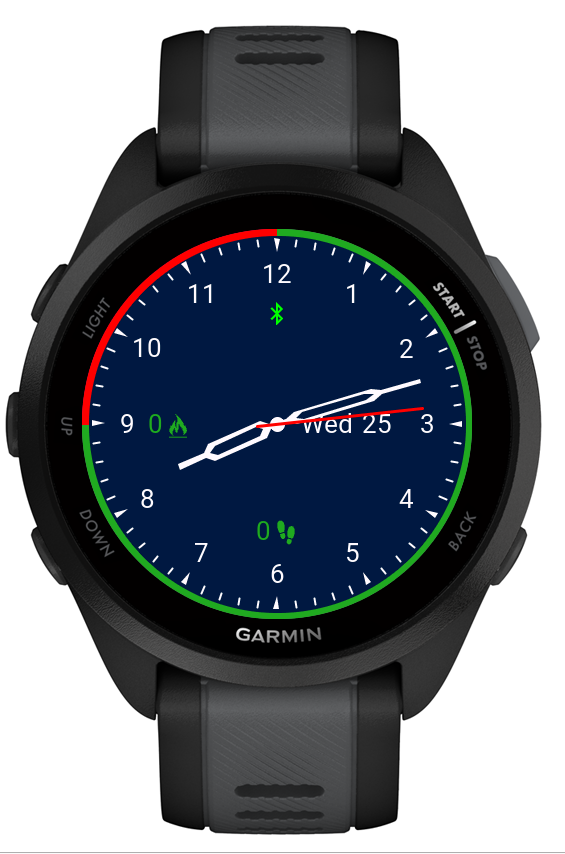
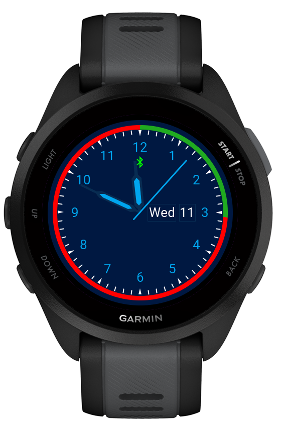
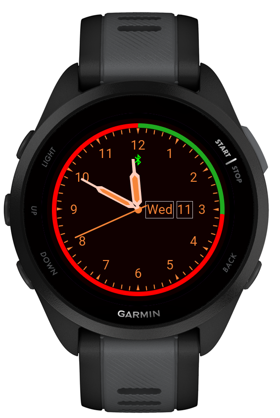
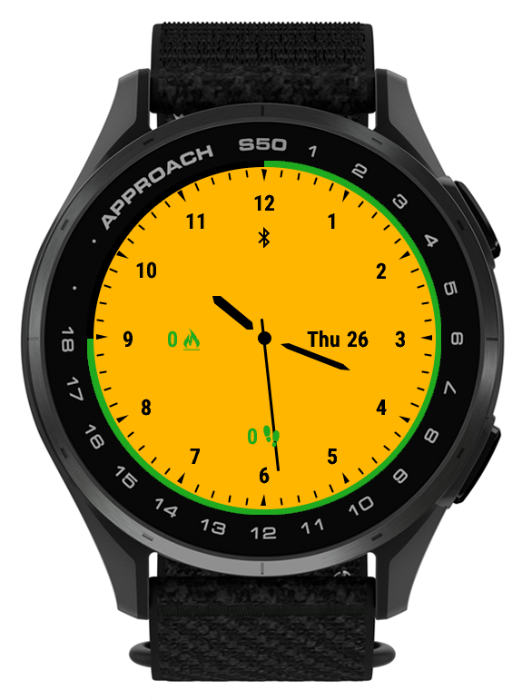
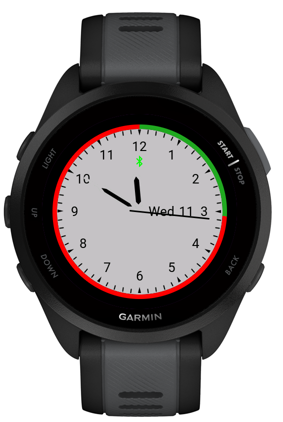
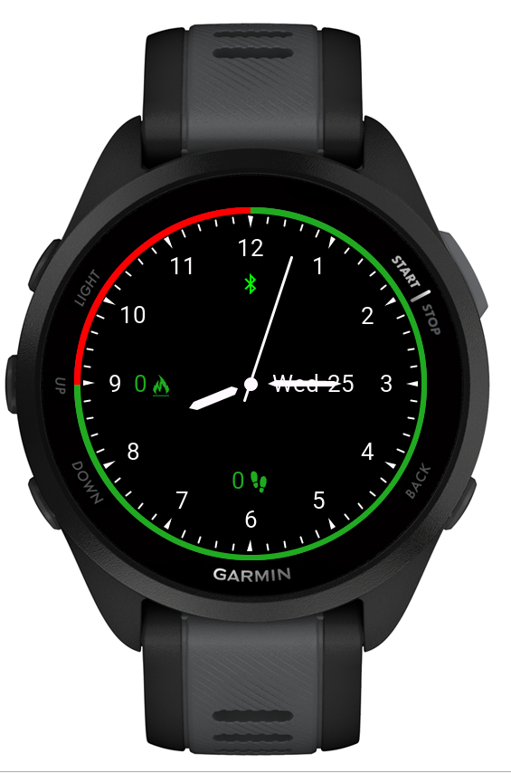
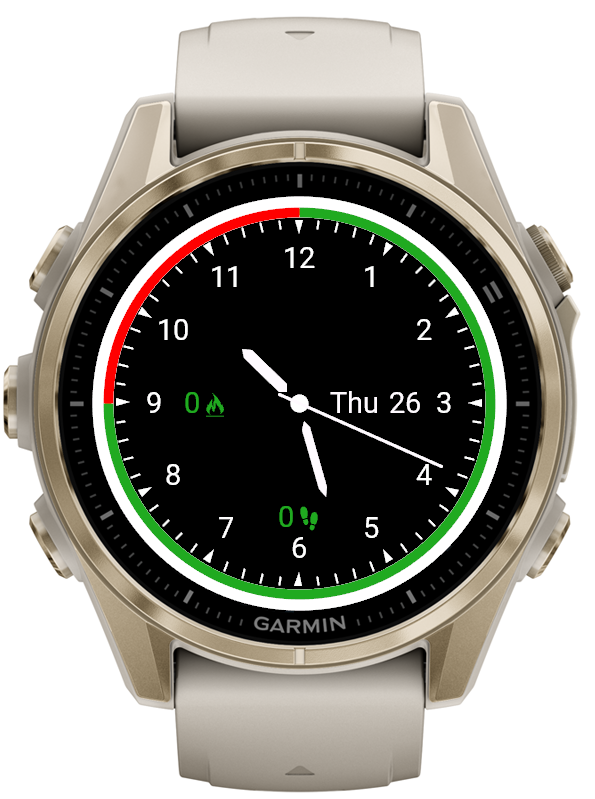
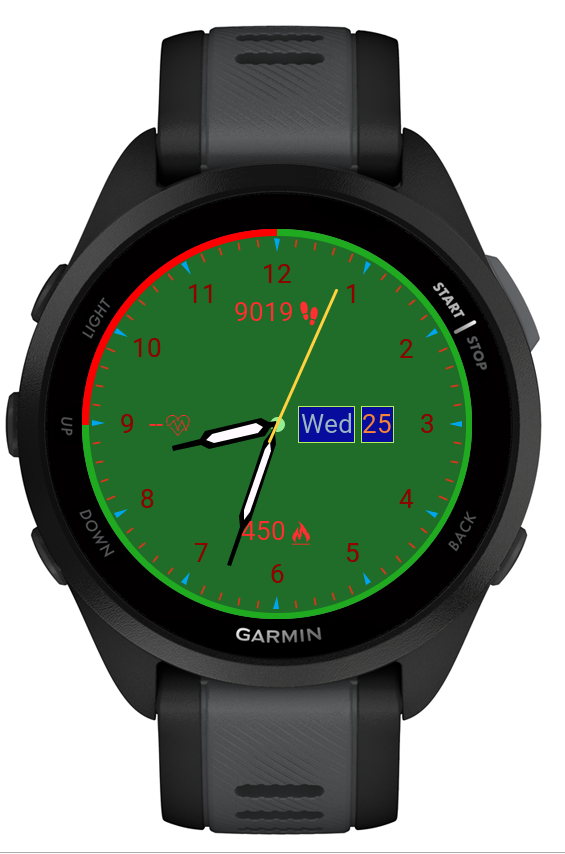
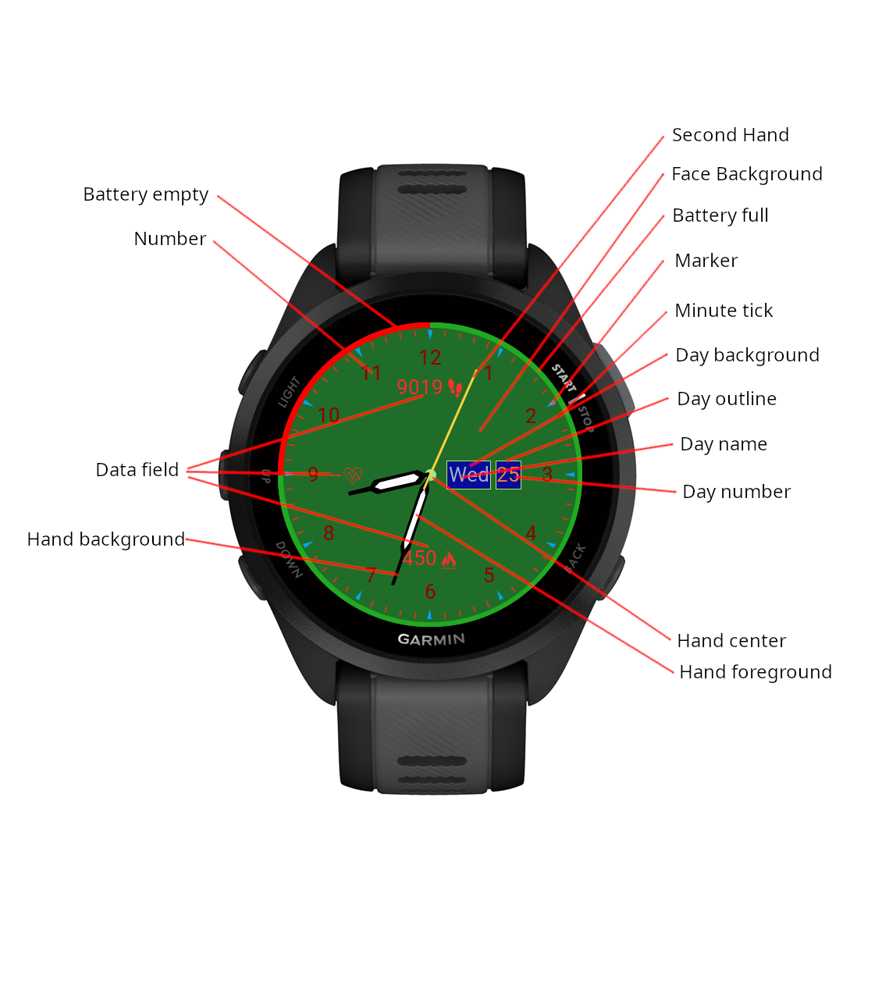

# Analog watch

The analog watch is a highly configurable analog watch with a number of default profile values and the possibility to create your own colors for the watch.

The standard profiles are:
- Red
- Blue steel
- Blue
- Orange
- White
- Black
- Custom

The standard profiles use the colors stored with the profile.

## Red Profile

## Blue steel Profile

## Blue Profile

## Orange Profile

## White Profile

## Black Profile

## Custom Profile

