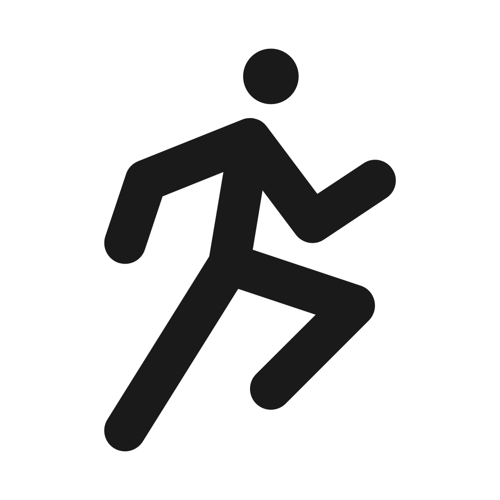

# Analogwatch

Watch implementation

# Publishing

- change debug level to Warning in the resources/properties/properties.xml and save this file
  > > <property id="MinimalDebugLevel" type="number">3</property>
- build an export
  > > `make clean-storage export &> release.log`
- publish the new app using https://apps.garmin.com/en-US/developer/upload and/or https://apps.garmin.com/apps/820dfa7e-7b9e-4e35-8e14-feb072e74d57
- publish a revised app using https://apps.garmin.com/en-US/developer/dashboard

# Navigation

| Input type       | Action           |
| ---------------- | ---------------- |
| Swipe left/right | Switch views     |
| Back button      | Switch backwards |
| Select short     | Add message      |
| Select long      | Switch forward   |

**key mapping**
| Simulator / Watch Button | Delegate Method |
|--------------------------|-----------------|
| Click / Tap / Space | onSelect() |
| Start / Enter | onSelect() |
| Long Start | onSelectHold() |
| ESC / Back | onBack() |
| Long ESC | onBackHold() |
| Swipe | onSwipe() |

# Events

```text
User Input (Key/Swipe/Touch)
         ↓
   [Operating System]
         ↓
   [Connect IQ Runtime]
         ↓
   [Your App - MessengerApp]
         ↓
   [Active View Stack]
         ↓
   [Current InputDelegate]
         ↓
   [Event Handler Methods]
```

## View stack

```text
View Stack (top to bottom):
┌─────────────────────────┐
│  ClockView              │ ← Inactive (no events)
│  ClockViewDelegate      │
├─────────────────────────┤
│  AnalogView             │ ← Inactive (no events)
│  AnalogViewDelegate     │
└─────────────────────────┘
```

## Events

Input Event Types

**Physical Inputs**

- Keys: UP, DOWN, ENTER, ESC, START, LAP, etc.
- Touch: Swipe (UP, DOWN, LEFT, RIGHT), Tap, Long Press
- Rotation: Digital crown (on some devices)

**Event Types**

- PRESS_TYPE_DOWN - Button pressed down
- PRESS_TYPE_UP - Button released
- PRESS_TYPE_ACTION - Complete press (down + up)

## Event Routing

Event Routing Order

When an event occurs, the framework calls handler methods in priority order on the active delegate:

```text
User presses UP button
         ↓
Framework checks delegate methods in order:
         ↓
1. onKeyPressed()      ← If returns true, STOP
   ↓ (returns false)
2. onKey()             ← If returns true, STOP
   ↓ (returns false)
3. onPreviousPage()    ← If returns true, STOP
   ↓ (returns false)
4. Default behavior    ← Framework's fallback
```

## Event handler priority

**Button events**

```text
// Priority 1: Specific key press/release
function onKeyPressed(keyEvent) → true/false

function onKeyReleased(keyEvent) → true/false

// Priority 2: General key handler
function onKey(keyEvent) → true/false

// Priority 3: Specialized handlers (mapped to specific keys)
function onNextPage()         // UP button
function onPreviousPage()     // DOWN button
function onSelect()           // ENTER/START button
function onBack()             // BACK/ESC button
function onMenu()             // MENU button (some devices)
```

**Touch events**

```
// Priority 1: Touch events
function onTap(clickEvent) → true/false

function onSwipe(swipeEvent) → true/false

function onDrag(dragEvent) → true/false

function onFlick(flickEvent) → true/false

function onHold(clickEvent) → true/false

function onRelease(clickEvent) → true/false
```

**Event Flow Example**

**Scenario: User swipes left on ClockView**

```
User swipes left
    ↓
┌─────────────────────────────────────┐
│ Connect IQ Framework                │
│ Detects swipe gesture               │
│ Direction: SWIPE_LEFT               │
└──────────────┬──────────────────────┘
               ↓
┌─────────────────────────────────────┐
│ Current View Stack                  │
│ Top: ClockView                   │
│      ClockViewDelegate           │ ← Active
└──────────────┬──────────────────────┘
               ↓
┌─────────────────────────────────────┐
│ ClockViewDelegate                │
│ onSwipe(swipeEvent) called          │
│   direction = SWIPE_LEFT            │
└──────────────┬──────────────────────┘
               ↓
┌─────────────────────────────────────┐
│ Your Code in onSwipe()              │
│ if (direction == SWIPE_LEFT) {      │
│   WatchUi.switchToView(             │
│     new AnalogView(),               │
│     new AnalogViewDelegate()        │
│   );                                │
│   return true; ← Event handled!     │
│ }                                   │
└──────────────┬──────────────────────┘
               ↓
┌─────────────────────────────────────┐
│ WatchUi.switchToView()              │
│ 1. Remove ClockView from stack   │
│ 2. Add AnalogView to stack          │
│ 3. AnalogView becomes active        │
└──────────────┬──────────────────────┘
               ↓
New View Stack:
┌─────────────────────────────────────┐
│ AnalogView           ← Now active   │
│ AnalogViewDelegate                  │
└─────────────────────────────────────┘
```

# Return Values Matter

Returning true:

"I handled this event"
Framework stops processing
Other handlers not called

Returning false:

"I didn't handle this event"
Framework continues to next handler
May trigger default behavior

# Current implementation

```text
MessengerApp
    ├── ClockView + ClockViewDelegate
    │   ├── onSwipe()         → Navigate views
    │   ├── onSelect()        → Go to MessagesView
    │   └── onBack()          → Go to AnalogView
    │
    └── AnalogView + AnalogViewDelegate
        ├── onSwipe()         → Navigate views
        ├── onSelect()        → Go to ClockView
        └── onBack()          → Go to MessagesView
```

# Examples

- https://github.com/CodyJung/connectiq-apps

# Fonts

To use specific symbols one can use symbols from free fonts. The steps to take are:
- generate font based on .svg files https://icomoon.io/ (online tool)
- convert font for garmin https://angelcode.com/products/bmfont/ (only works on windows or for linux users in wine)

This is the part most developers find tricky. You don't "write" these files; you generate them:
Find an SVG: Download a Bluetooth SVG (e.g., from FontAwesome or Google Material Icons).
Use a Web Tool: Go to IcoMoon.io.
Upload your SVG.

Click Generate Font.
Under "Preferences," ensure the "Class Prefix" is simple.
Convert for Garmin: Use the BMFont (AngelCode) tool to export the font as a .fnt file and a single-bit (White on Transparent) .png.
Crucial: Connect IQ fonts must be white on a transparent/black background in the PNG; the dc.setColor command replaces the white pixels with your chosen color.
The Resource File (resources/fonts/fonts.xml)
First, you must define the font in your resources. You will need a .fnt (mapping file) and a .png (the actual glyphs) created by a tool like BMFont or FontAssetCreator.

The generated font file is [here](./resources/fonts/icons.fnt) with the [bitmaps](./resources/fonts/icons_0.png). The character id is used to identify the symbol in this font. The x and y are the position of the symbol in the bitmap.

```xml
<resources>
    <font id="IconFont" filename="fonts/icons.fnt" antialias="true" />
</resources>
```
## Font converting
1. Initial Setup
      - Download BMFont: Get it from the AngelCode website.
      - Install your Icon Font: If you downloaded a font (like FontAwesome) or created one via IcoMoon, install the .ttf or .otf file onto your Windows system so BMFont can see it.

2. Font Settings
      - Open BMFont and go to Options > Font Settings.
      - Font: Select your installed icon font (e.g., "IcoMoon" or "FontAwesome").
      - Charset: Set to Unicode.
      - Size (px): Set this to the height you want the icon to be on your Forerunner 165 (e.g., 24 or 32).
      - Height %: 100%.
      - Font Smoothing: Check this if you want anti-aliasing.

3. Export Settings (The "Garmin" Critical Step)
This is where most developers fail. Go to Options > Export Settings.

      - Padding: Set all to 0.
      - Spacing: 1 for both horiz and vert.
      - Bit Depth: 8.
      - Presets: Select White text with alpha.
      - Font Descriptor: Select Text. (Garmin cannot read the binary format).
      - Textures: Select png.
      - Width/Height: Start with 256 x 256. You want your entire icon set to fit on one single image file.

# Symbolen

De volgende symbolen opgenomen
- active U+F013 
- active html 
- path distance U+F012 
- line distance U+F011 
- hart beat U+F010 
- hart U+F00F 
- stairs U+F00E 
- battery U+F00D 
- battery U+F00C 
- battery U+F00B 
- battery U+F00A 
- battery U+F009 
- calories U+F008 

- email U+F007 
- steps U+F006 
- search U+F005 
- wait U+F004 
- wait U+F003 
- documents U+F002 
- file U+F001 
- bluetooth U+F000 

# Colors


## Neutrals
- `#000000` **black**
- `#253237` **jet black**

## Red / Warm Group
- `#2d080a` **rich mahogany**
- `#960200` **oxblood**
- `#b20a1b` **mahogany red**
- `#7c3626` **chestnut**
- `#ca3c25` **burnt tangerine**
- `#ff0022` **racing red**
- `#ff0000` **red**
- `#ff3333` **cinnabar**
- `#f6511d` **crimson carrot**
- `#ce6c47` **burnt peach**
- `#f5853f` **pumpkin spice**
- `#ffb400` **amber flame**
- `#ffd046` **golden pollen**
- `#ffbfb7` **powder blush**

## Green Group
- `#162615` **forest night**
- `#1a3a22` **deep spruce**
- `#206f28` **turf green**
- `#355e3b` **hunter green**
- `#26a924` **green**
- `#32965d` **jade empire**
- `#43b581` **amazonite**
- `#7fb800` **lime moss**
- `#90ee90` **apple tart**
- `#93c572` **pistachio**
- `#b2ec5d` **spring leaf**
- `#b4f8c8` **menthe**
- `#d0f0c0` **pale neon**
- `#e2f3e4` **dewdrop**

## Blue Group
- `#061a40` **prussian blue**
- `#0d2c54` **oxford navy**
- `#241e4e` **dark amethyst**
- `#07354b` **deep space blue**
- `#090c9b` **navy electric**
- `#1c5373` **yale blue**
- `#0353a4` **sapphire**
- `#006daa` **cornflower ocean**
- `#3066be` **smart blue**
- `#00a6ed` **fresh sky**
- `#9db4c0` **cool steel**
- `#b4c5e4` **powder blue**
- `#b9d6f2` **pale sky**
- `#e0fbfc` **light cyan**

## Light Neutrals
- `#c0c0c0` **silver**
- `#eeebd0` **beige**
- `#fbfff1` **ivory**
- `#ffffff` **white**

**Option 2**

## Color Palette

### Neutrals


### Red / Warm Group


### Green Group


### Blue Group


### Light Neutrals


**Option 3**

| Color | Hex | Name |
|-------|-----|------|
|  | `#000000` | black |
|  | `#253237` | jet black |
|  | `#2d080a` | rich mahogany |
|  | `#960200` | oxblood |
|  | `#b20a1b` | mahogany red |

**Option 4**

<svg width="600" height="30">
  <rect width="600" height="30" fill="#000000"/>
  <text x="10" y="20" fill="white" font-family="Arial" font-size="14">black - #000000</text>
</svg>

<svg width="600" height="30">
  <rect width="600" height="30" fill="#253237"/>
  <text x="10" y="20" fill="white" font-family="Arial" font-size="14">jet black - #253237</text>
</svg>