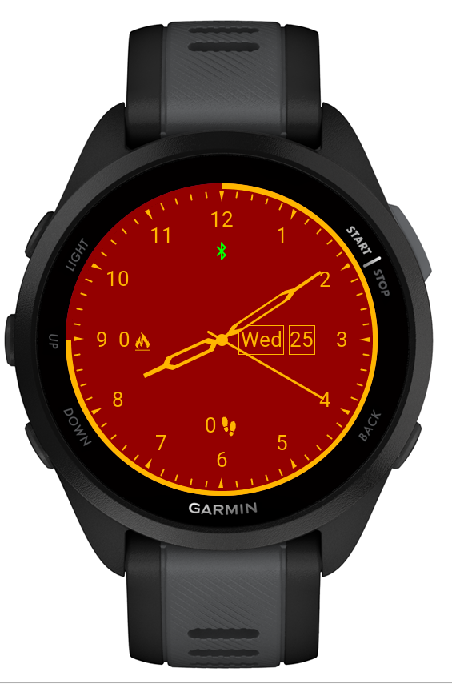
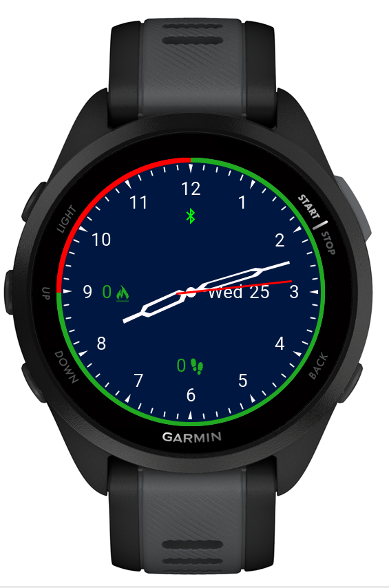
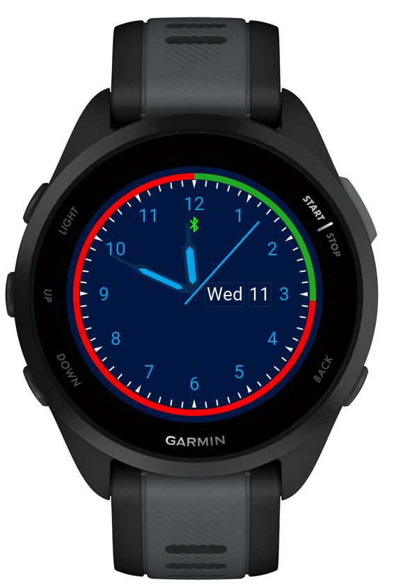
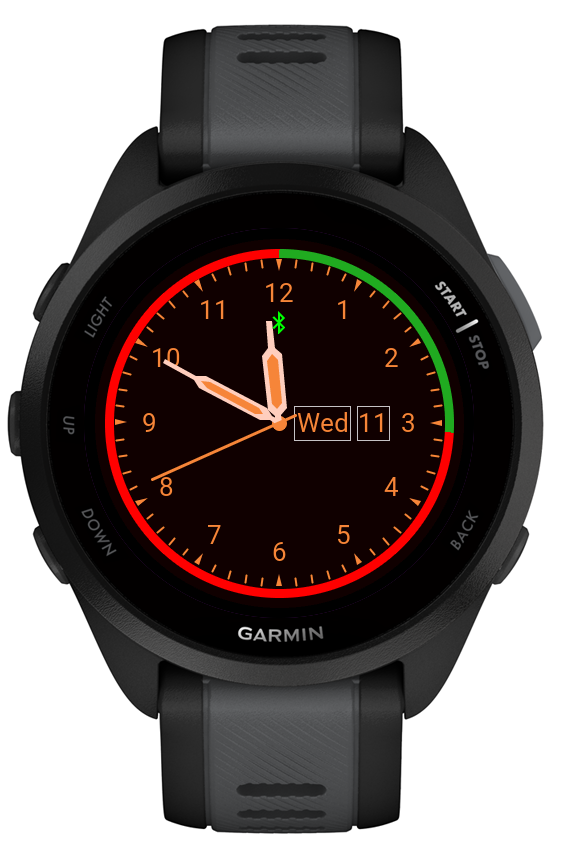
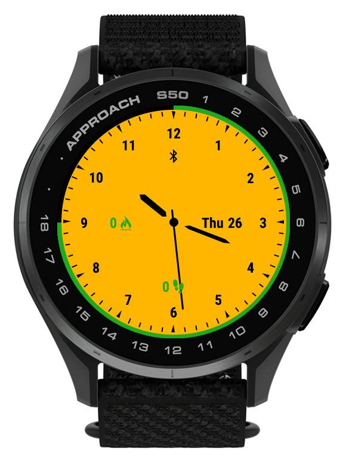
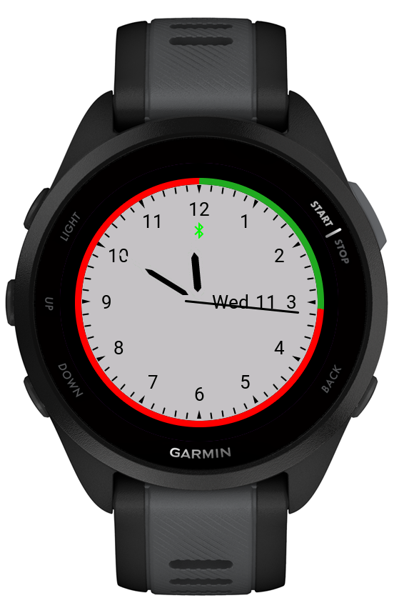
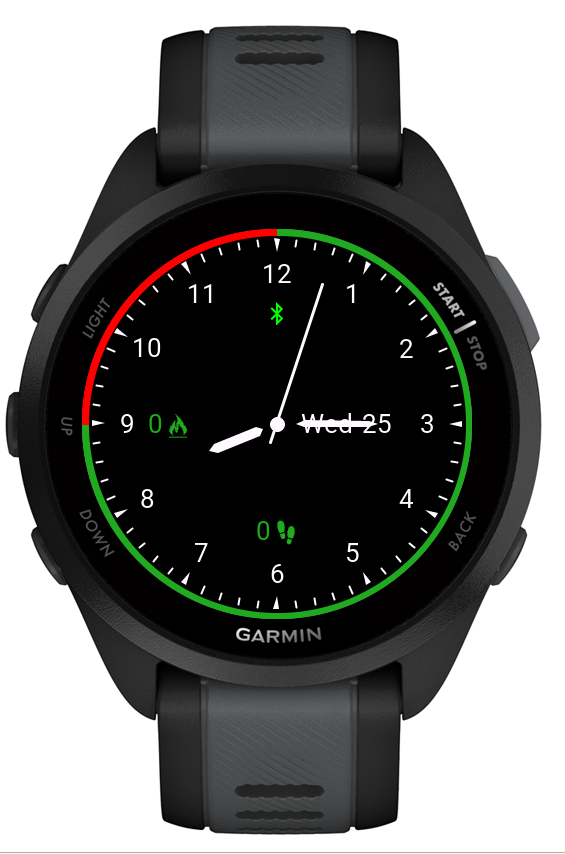
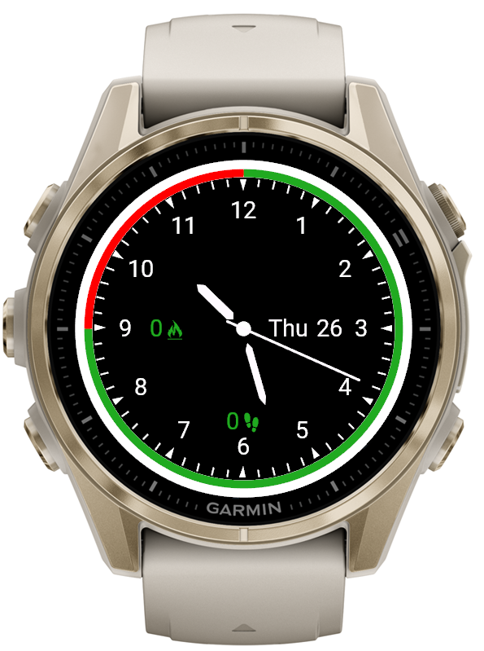
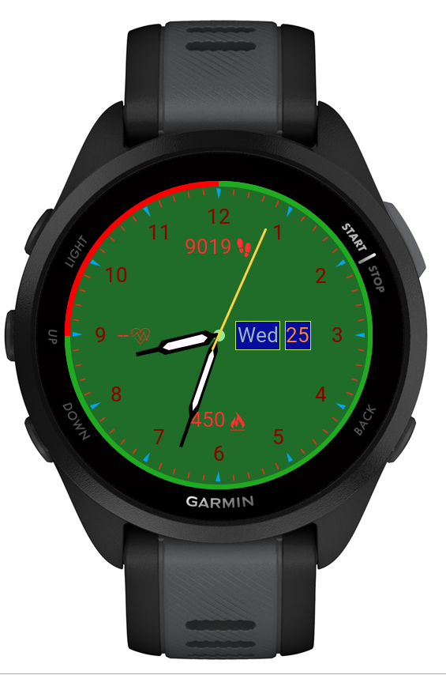
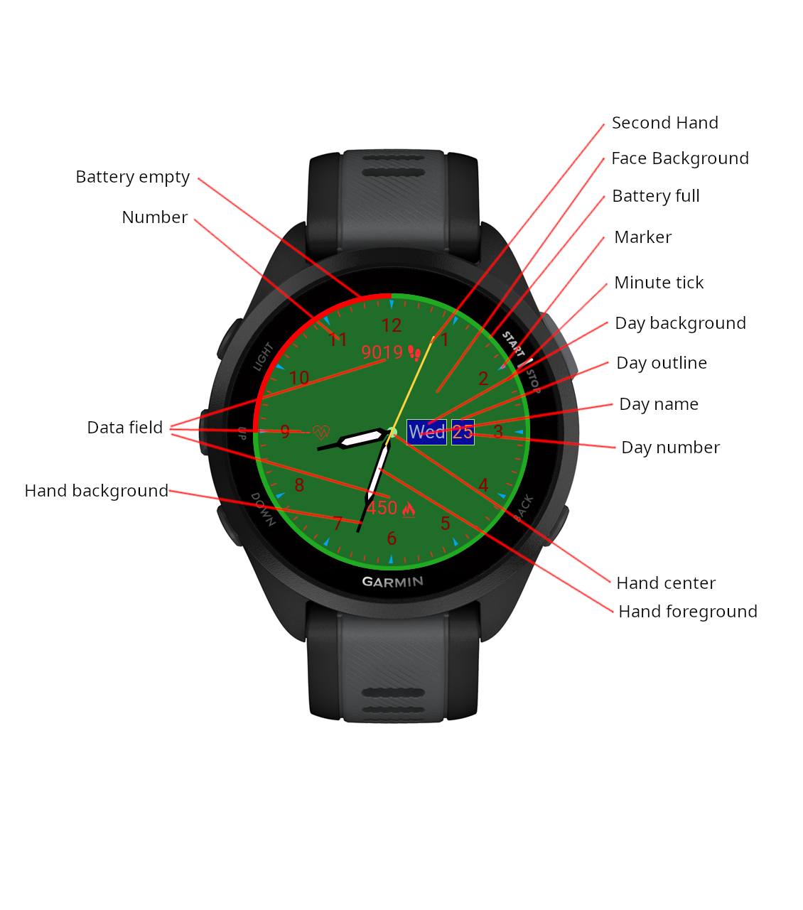

# Analog watch

The analog watch is a highly configurable analog watch with a number of default profile values and the possibility to create your own colors for the watch.

The standard profiles are:
- Red
- Blue steel
- Blue
- Orange
- White
- Black
- Custom

The standard profiles use the colors stored with the profile.

## Red Profile

## Blue steel Profile

## Blue Profile

## Orange Profile

## White Profile

## Black Profile

## Custom Profile

# Devices

| Device ID	              | Shape	         | Resolution (W x H) |
|-------------------------|------------------|--------------------|
| fr55	                  | Round            |	208 x 208         |
| vivoactive4s	          | Round            |	218 x 218         |
| approachs50	          | Round            |	240 x 240         |
| descentmk2s	          | Round            |	240 x 240         |
| fenix5plus	          | Round            |	240 x 240         |
| fenix5splus	          | Round            |	240 x 240         |
| fenix5xplus	          | Round            |	240 x 240         |
| fenix6s	              | Round            |	240 x 240         |
| fenix6spro	          | Round            |	240 x 240         |
| fenix7s	              | Round            |	240 x 240         |
| fenix7spro	          | Round            |	240 x 240         |
| fr245 / fr245m	      | Round            |	240 x 240         |
| fr255s / fr255sm	      | Round            |	240 x 240         |
| fr645m	              | Round            |	240 x 240         |
| fr745	                  | Round            |	240 x 240         |
| fr945	                  | Round            |	240 x 240         |
| fr945lte	              | Round            |	240 x 240         |
| marq (Gen 1 Variants)	  | Round            |	240 x 240         |
| vivoactive3m	          | Round            |	240 x 240         |
| venusq / venusqm	      | Square/Rectangle | 240 x 240          |
| fenix6	              | Round            |	260 x 260         |
| fenix6pro	              | Round            |	260 x 260         |
| fenix7	              | Round            |	260 x 260         |
| fenix7pro	              | Round            |	260 x 260         |
| fenix7pronowifi	      | Round            |	260 x 260         |
| fenix8solar47mm	      | Round            |	260 x 260         |
| fr255 / fr255m	      | Round            |	260 x 260         |
| fr955	                  | Round            |	260 x 260         |
| legacyherocaptainmarvel | Round            |	260 x 260         |
| legacyherofirstavenger  | Round            |	260 x 260         |
| legacysagadarthvader	  | Round            |	260 x 260         |
| legacysagarey	          | Round            |	260 x 260         |
| vivoactive4	          | Round            |	260 x 260         |
| descentg2	              | Round            |	280 x 280         |
| descentmk2	          | Round            |	280 x 280         |
| enduro	              | Round            |	280 x 280         |
| enduro3	              | Round            |	280 x 280         |
| fenix6xpro	          | Round            |	280 x 280         |
| fenix7x	              | Round            |	280 x 280         |
| fenix7xpro	          | Round            |	280 x 280         |
| fenix7xpronowifi	      | Round            |	280 x 280         |
| fenix8solar51mm	      | Round            |	280 x 280         |
| venusq2 / venusq2m      | Rectangle	     |  320 x 360         |
| fr265s	              | Round            |	360 x 360         |
| venu2s	              | Round            |	360 x 360         |
| approachs7042mm	      | Round            |	390 x 390         |
| d2air	                  | Round            |	390 x 390         |
| d2airx10	              | Round            |	390 x 390         |
| descentmk343mm	      | Round            |	390 x 390         |
| epix2pro42mm	          | Round            |	390 x 390         |
| fenix843mm	          | Round            |	390 x 390         |
| fr165 / fr165m	      | Round            |	390 x 390         |
| fr57042mm	              | Round            |	390 x 390         |
| instinct3amoled45mm	  | Round            |	390 x 390         |
| marq2 (All Variants)	  | Round            |	390 x 390         |
| venu	                  | Round            |	390 x 390         |
| venu3s	              | Round            |	390 x 390         |
| venu441mm	              | Round            |	390 x 390         |
| venud / venux1	      | Round            |	390 x 390         |
| d2mach1	              | Round            |	416 x 416         |
| epix2	                  | Round            |	416 x 416         |
| epix2pro47mm	          | Round            |	416 x 416         |
| fenix847mm	          | Round            |	416 x 416         |
| fenix8pro47mm	          | Round            |	416 x 416         |
| fenixe	              | Round            |	416 x 416         |
| fr265	                  | Round            |	416 x 416         |
| fr57047mm	              | Round            |	416 x 416         |
| venu2	                  | Round            |	416 x 416         |
| venu2plus	              | Round            |	416 x 416         |
| approachs7047mm	      | Round            |	454 x 454         |
| d2mach2	              | Round            |	454 x 454         |
| descentmk351mm	      | Round            |	454 x 454         |
| epix2pro51mm	          | Round            |	454 x 454         |
| fr965	                  | Round            |	454 x 454         |
| fr970	                  | Round            |	454 x 454         |
| instinct3amoled50mm	  | Round            |	454 x 454         |
| venu3	                  | Round            |	454 x 454         |
| venu445mm	              | Round            |	454 x 454         |
